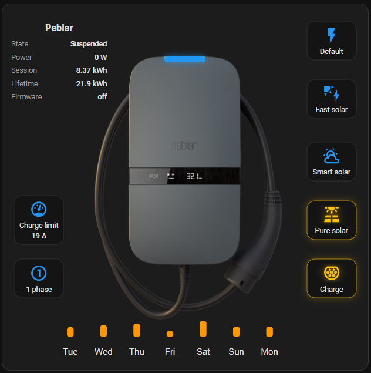

# [HAPeblar-Dash](https://github.com/EddyBurnett/HAPeblar-Dash)

A custom Home Assistant dashboard for a Peblar EV Charger, built with the standard Picture Elements card and a small set of HACS frontend cards. It provides charging controls, live charger information, an animated virtual status LED, and a seven-day energy chart.

## Screenshot



## Features

- Charging-mode controls: Default, Fast Solar, Smart Solar, and Pure Solar
- Start/stop charging control
- Charge-limit control and single-phase toggle
- Live state, power, session energy, lifetime energy, and firmware information
- Animated virtual charger status LED
- Seven-day daily energy-use chart
- Transparent styling designed around a Peblar charger background image

## Requirements

Install these frontend cards through [HACS](https://hacs.xyz/):

- [Button Card](https://github.com/custom-cards/button-card) (`custom:button-card`)
- [ApexCharts Card](https://github.com/RomRider/apexcharts-card) (`custom:apexcharts-card`)
- [card-mod](https://github.com/thomasloven/lovelace-card-mod)

The main dashboard uses Home Assistant's standard `picture-elements` card; no custom replacement is required.

## Installation

1. Install the required HACS frontend cards and reload Home Assistant.
2. Add the Peblar integration and confirm that its entities are available.
3. Copy `peblar_size1.png` to Home Assistant's `/config/www/dashboard/` directory. It must be reachable as:

   ```text
   /local/dashboard/peblar_size1.png
   ```

4. Open a Home Assistant dashboard, choose **Edit dashboard**, and add a **Manual** card.
5. Copy the configuration from [`HAPeblar-Dash.yamll`](HAPeblar-Dash.yaml) into the card.
6. Replace any entity IDs that differ in your Home Assistant installation.

## Peblar entities

The dashboard configuration uses these entities from the Peblar integration:

| Entity | Purpose |
| --- | --- |
| `sensor.peblar_ev_charger_state` | Charger state and virtual LED |
| `sensor.peblar_ev_charger_power` | Current charging power |
| `sensor.peblar_ev_charger_session_energy` | Current session energy |
| `sensor.peblar_ev_charger_lifetime_energy` | Lifetime energy and chart source |
| `select.peblar_ev_charger_smart_charging` | Charging-mode selection |
| `switch.peblar_ev_charger_charge` | Start or stop charging |
| `switch.peblar_ev_charger_force_single_phase` | Single-phase control |
| `number.peblar_ev_charger_charge_limit` | Charge-current limit |
| `update.peblar_ev_charger_firmware` | Firmware status |

Entity IDs can vary depending on the device name used during setup.

## Virtual status LED

The LED is a `custom:button-card` overlay positioned on the charger image. It maps `sensor.peblar_ev_charger_state` as follows:

| Home Assistant state | Virtual LED |
| --- | --- |
| `no_ev_connected` | Green, steady |
| `suspended` | Blue, steady |
| `charging` | Blue, pulsing |
| `error`, `fault`, `invalid` | Red, pulsing |
| Any other or unavailable state | Grey |

This mapping is an approximation of the charger states available in Home Assistant. The Peblar integration does not expose every physical LED substate, so the virtual LED cannot reproduce all hardware indications one-to-one.

## Seven-day energy chart

The ApexCharts card uses the statistics of `sensor.peblar_ev_charger_lifetime_energy` and calculates the daily `change` for each of the last seven days. The source entity should provide long-term statistics and behave as a cumulative lifetime-energy sensor.

## Credits and disclaimer

This dashboard was built with help from ChatGPT Work / Codex and then customized for this Peblar and Home Assistant setup. It is an unofficial community project and is not affiliated with or supported by Peblar or Home Assistant.
